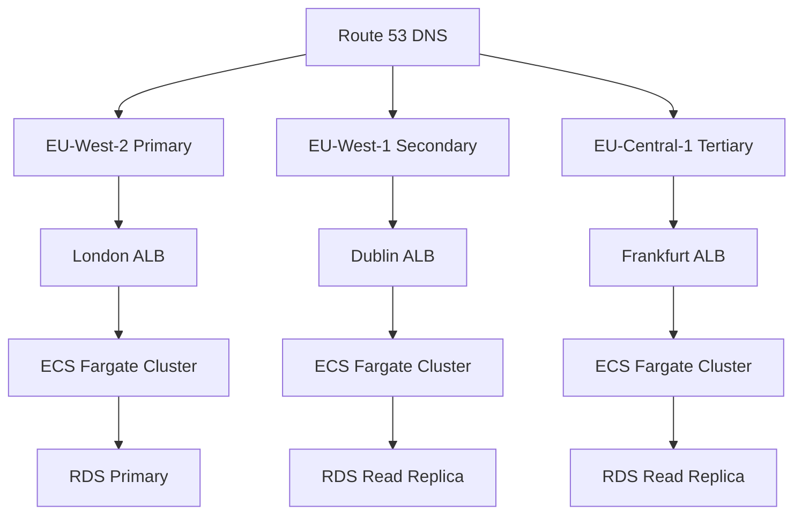

# TyreHero Emergency Service - Production Deployment Strategy

## Executive Summary

This document outlines a comprehensive production deployment strategy for TyreHero's 24/7 emergency mobile tyre service, designed to achieve 99.9% uptime and ensure reliable emergency response capabilities.

## Critical Requirements Analysis

### Emergency Service SLAs
- **Uptime**: 99.9% (max 8.76 hours downtime per year)
- **Response Time**: 90-minute emergency response guarantee
- **Availability**: 24/7/365 service
- **Geographic Coverage**: UK-wide service delivery
- **Customer Safety**: Zero tolerance for emergency service failures

### Traffic Patterns
- **Peak Emergency Periods**: Weather events, holidays, rush hours
- **Geographic Distribution**: Higher density in urban areas
- **Seasonal Variations**: Winter weather increases demand 3-5x
- **Critical Dependencies**: Phone systems, GPS tracking, payment processing

## 1. Multi-Region Production Architecture

### Primary Infrastructure Design

```yaml
# Infrastructure Overview
Regions:
  Primary: eu-west-2 (London)
  Secondary: eu-west-1 (Ireland) 
  Tertiary: eu-central-1 (Frankfurt)

Load Balancing:
  Global: AWS Route 53 with health checks
  Regional: Application Load Balancer (ALB)
  Local: Target Groups with health monitoring

Database Architecture:
  Primary: Amazon RDS PostgreSQL Multi-AZ
  Read Replicas: Cross-region for disaster recovery
  Cache: Amazon ElastiCache Redis Cluster
  Backup: Automated cross-region snapshots
```

### Geographic Distribution Strategy



## 2. Container Orchestration & Scaling

### ECS Fargate Configuration

```yaml
# fargate-service.yml
service:
  name: tyrehero-emergency-api
  cluster: tyrehero-production
  task_definition: tyrehero-emergency:latest
  desired_count: 6
  launch_type: FARGATE
  
  network_configuration:
    subnets:
      - subnet-private-1a
      - subnet-private-1b
      - subnet-private-1c
    security_groups:
      - sg-tyrehero-api
    assign_public_ip: false

  load_balancers:
    - target_group_arn: arn:aws:elasticloadbalancing:...
      container_name: tyrehero-api
      container_port: 3000

  service_registries:
    - registry_arn: arn:aws:servicediscovery:...

  auto_scaling:
    min_capacity: 6
    max_capacity: 50
    target_cpu: 60
    target_memory: 70
    
    scale_out_cooldown: 60s
    scale_in_cooldown: 300s
    
    custom_metrics:
      - emergency_requests_per_minute > 10
      - api_response_time_p99 > 2000ms
```

### Auto-Scaling for Emergency Spikes

```yaml
# cloudwatch-alarms.yml
emergency_spike_scaling:
  metric_name: EmergencyRequestsPerMinute
  threshold: 15
  comparison: GreaterThanThreshold
  evaluation_periods: 2
  period: 60
  
  actions:
    scale_out:
      adjustment_type: ChangeInCapacity
      scaling_adjustment: 5
      cooldown: 300
    
    notifications:
      - sns_topic: arn:aws:sns:eu-west-2:account:emergency-alerts
      - slack_webhook: operations_channel

weather_event_scaling:
  metric_name: WeatherAlertActive
  threshold: 1
  comparison: GreaterThanOrEqualToThreshold
  
  actions:
    scale_out:
      adjustment_type: PercentChangeInCapacity
      scaling_adjustment: 200
      cooldown: 180
```

## 3. Database Architecture & Replication

### Multi-AZ PostgreSQL Setup

```sql
-- Primary Database Configuration
-- RDS PostgreSQL 15.x with Multi-AZ deployment

-- Critical Tables for Emergency Service
CREATE TABLE emergency_requests (
    id UUID PRIMARY KEY DEFAULT gen_random_uuid(),
    customer_name VARCHAR(255) NOT NULL,
    phone_number VARCHAR(20) NOT NULL,
    location_address TEXT NOT NULL,
    location_coordinates POINT NOT NULL,
    vehicle_make_model VARCHAR(255) NOT NULL,
    tyre_issue emergency_issue_type NOT NULL,
    status request_status DEFAULT 'pending',
    priority_level INTEGER DEFAULT 1,
    created_at TIMESTAMP WITH TIME ZONE DEFAULT NOW(),
    updated_at TIMESTAMP WITH TIME ZONE DEFAULT NOW(),
    technician_id UUID REFERENCES technicians(id),
    estimated_arrival TIMESTAMP WITH TIME ZONE,
    actual_arrival TIMESTAMP WITH TIME ZONE,
    completion_time TIMESTAMP WITH TIME ZONE
);

-- Indexing for Performance
CREATE INDEX CONCURRENTLY idx_emergency_requests_status ON emergency_requests(status);
CREATE INDEX CONCURRENTLY idx_emergency_requests_location ON emergency_requests USING GIST(location_coordinates);
CREATE INDEX CONCURRENTLY idx_emergency_requests_created_at ON emergency_requests(created_at);
CREATE INDEX CONCURRENTLY idx_emergency_requests_priority ON emergency_requests(priority_level, created_at);
```

### Database Replication Strategy

```yaml
# database-replication.yml
primary_database:
  instance_class: db.r6g.2xlarge
  multi_az: true
  backup_retention: 30
  backup_window: "03:00-04:00"
  maintenance_window: "sun:04:00-sun:05:00"
  
  performance_insights: true
  monitoring_interval: 60
  
  parameter_group:
    shared_preload_libraries: pg_stat_statements
    log_min_duration_statement: 1000
    log_statement: ddl

read_replicas:
  emergency_reporting:
    instance_class: db.r6g.xlarge
    region: eu-west-1
    lag_threshold: 10s
    
  analytics:
    instance_class: db.r6g.large
    region: eu-central-1
    lag_threshold: 30s

connection_pooling:
  primary: pgbouncer (100 connections)
  read_replicas: pgbouncer (50 connections each)
```

## 4. CDN & Global Performance

### CloudFront Distribution

```yaml
# cloudfront-distribution.yml
distribution:
  origins:
    - domain_name: tyrehero-api.eu-west-2.amazonaws.com
      origin_id: primary-api
      custom_origin_config:
        origin_protocol_policy: https-only
        origin_ssl_protocols: [TLSv1.2]
    
    - domain_name: tyrehero-static.s3.eu-west-2.amazonaws.com
      origin_id: static-assets
      s3_origin_config:
        origin_access_identity: EXXXXXXXXXXXX

  behaviors:
    - path_pattern: /api/emergency/*
      target_origin: primary-api
      cache_policy: Disabled
      origin_request_policy: CORS-S3Origin
      compress: true
      viewer_protocol_policy: redirect-to-https
      
    - path_pattern: /static/*
      target_origin: static-assets
      cache_policy: CachingOptimized
      ttl: 31536000  # 1 year
      compress: true

  geo_restrictions:
    restriction_type: whitelist
    locations: [GB, IE]  # UK and Ireland only

  price_class: PriceClass_100  # US, Canada, Europe
  
  custom_error_pages:
    - error_code: 500
      response_page_path: /error/500.html
      response_code: 500
    - error_code: 503
      response_page_path: /maintenance.html
      response_code: 503
```

### Edge Locations for UK Coverage

```yaml
# Performance targets by region
performance_targets:
  london_metro:
    target_ttfb: <50ms
    target_load_time: <800ms
    edge_locations: [LHR50, LHR62, LCY4]
    
  manchester_birmingham:
    target_ttfb: <75ms
    target_load_time: <1000ms
    edge_locations: [MAN50, BHX50]
    
  scotland_wales:
    target_ttfb: <100ms
    target_load_time: <1200ms
    edge_locations: [EDI2, CWL50]
```

## 5. Zero-Downtime CI/CD Pipeline

### Blue-Green Deployment Strategy

```yaml
# .github/workflows/production-deploy.yml
name: Production Emergency Service Deploy

on:
  push:
    branches: [main]
    paths:
      - 'src/**'
      - 'package.json'
      - 'Dockerfile'

env:
  AWS_REGION: eu-west-2
  ECR_REPOSITORY: tyrehero/emergency-api
  ECS_SERVICE: tyrehero-emergency-api
  ECS_CLUSTER: tyrehero-production

jobs:
  test:
    runs-on: ubuntu-latest
    steps:
      - uses: actions/checkout@v4
      
      - name: Run Unit Tests
        run: |
          npm ci
          npm run test:unit
          npm run test:integration
          
      - name: Security Scan
        run: |
          npm audit --audit-level high
          docker run --rm -v $(pwd):/src sonarqube/sonar-scanner-cli
          
      - name: Load Testing
        run: |
          # Simulate emergency request load
          k6 run tests/load/emergency-requests.js

  build:
    needs: test
    runs-on: ubuntu-latest
    outputs:
      image: ${{ steps.image.outputs.image }}
    steps:
      - uses: actions/checkout@v4
      
      - name: Build and Push Image
        id: image
        run: |
          IMAGE_TAG=${{ github.sha }}
          docker build -t $ECR_REPOSITORY:$IMAGE_TAG .
          docker push $ECR_REPOSITORY:$IMAGE_TAG
          echo "image=$ECR_REPOSITORY:$IMAGE_TAG" >> $GITHUB_OUTPUT

  deploy:
    needs: build
    runs-on: ubuntu-latest
    steps:
      - name: Blue-Green Deployment
        run: |
          # Create new task definition
          aws ecs register-task-definition \
            --family tyrehero-emergency \
            --task-role-arn arn:aws:iam::account:role/tyrehero-task-role \
            --execution-role-arn arn:aws:iam::account:role/tyrehero-execution-role \
            --network-mode awsvpc \
            --requires-compatibilities FARGATE \
            --cpu 1024 \
            --memory 2048 \
            --container-definitions '[{
              "name": "tyrehero-api",
              "image": "${{ needs.build.outputs.image }}",
              "portMappings": [{"containerPort": 3000}],
              "environment": [
                {"name": "NODE_ENV", "value": "production"},
                {"name": "DATABASE_URL", "valueFrom": "arn:aws:ssm:eu-west-2:account:parameter/tyrehero/database-url"}
              ],
              "logConfiguration": {
                "logDriver": "awslogs",
                "options": {
                  "awslogs-group": "/ecs/tyrehero-emergency",
                  "awslogs-region": "eu-west-2",
                  "awslogs-stream-prefix": "ecs"
                }
              },
              "healthCheck": {
                "command": ["CMD-SHELL", "curl -f http://localhost:3000/health || exit 1"],
                "interval": 30,
                "timeout": 5,
                "retries": 3,
                "startPeriod": 60
              }
            }]'
          
          # Update service with new task definition
          aws ecs update-service \
            --cluster $ECS_CLUSTER \
            --service $ECS_SERVICE \
            --task-definition tyrehero-emergency:$GITHUB_RUN_NUMBER
          
          # Wait for deployment to complete
          aws ecs wait services-stable \
            --cluster $ECS_CLUSTER \
            --services $ECS_SERVICE

      - name: Verify Deployment Health
        run: |
          # Health check the new deployment
          for i in {1..30}; do
            if curl -f https://api.tyrehero.com/health; then
              echo "Deployment healthy"
              break
            fi
            sleep 10
          done
          
      - name: Rollback on Failure
        if: failure()
        run: |
          # Rollback to previous task definition
          PREVIOUS_TASK_DEF=$(aws ecs describe-services \
            --cluster $ECS_CLUSTER \
            --services $ECS_SERVICE \
            --query 'services[0].deployments[1].taskDefinition' \
            --output text)
          
          aws ecs update-service \
            --cluster $ECS_CLUSTER \
            --service $ECS_SERVICE \
            --task-definition $PREVIOUS_TASK_DEF
```

### Emergency Hotfix Pipeline

```yaml
# .github/workflows/emergency-hotfix.yml
name: Emergency Hotfix Deploy

on:
  workflow_dispatch:
    inputs:
      severity:
        description: 'Severity Level'
        required: true
        default: 'critical'
        type: choice
        options:
        - critical
        - high
        - medium
      
      description:
        description: 'Hotfix Description'
        required: true

jobs:
  emergency-deploy:
    runs-on: ubuntu-latest
    if: github.event.inputs.severity == 'critical'
    steps:
      - name: Fast-Track Deployment
        run: |
          # Skip non-critical tests for emergency deployment
          # Direct deployment with 2-minute time limit
          echo "Deploying emergency hotfix: ${{ github.event.inputs.description }}"
          
          # Immediate notification to operations team
          curl -X POST ${{ secrets.SLACK_WEBHOOK_EMERGENCY }} \
            -H 'Content-type: application/json' \
            --data '{
              "text": "🚨 EMERGENCY HOTFIX DEPLOYMENT STARTED",
              "attachments": [{
                "color": "danger",
                "fields": [{
                  "title": "Description",
                  "value": "${{ github.event.inputs.description }}",
                  "short": false
                }]
              }]
            }'
```

## 6. Comprehensive Monitoring Strategy

### Real-Time Monitoring Stack

```yaml
# monitoring-stack.yml
prometheus:
  retention: 30d
  storage: 500GB
  
  scrape_configs:
    - job_name: tyrehero-api
      targets: ['api:3000']
      scrape_interval: 15s
      metrics_path: /metrics
      
    - job_name: nginx
      targets: ['nginx:8080']
      scrape_interval: 30s
      
    - job_name: postgres
      targets: ['postgres-exporter:9187']
      scrape_interval: 30s

grafana:
  dashboards:
    - emergency_service_overview
    - api_performance_metrics
    - database_health
    - infrastructure_status
    - business_metrics

alertmanager:
  routes:
    critical:
      group_wait: 10s
      group_interval: 5m
      repeat_interval: 12h
      receiver: emergency_team
      
    warning:
      group_wait: 30s
      group_interval: 5m
      repeat_interval: 4h
      receiver: ops_team

  receivers:
    emergency_team:
      - pagerduty_config:
          severity: critical
          client: "TyreHero Emergency Service"
      - slack_config:
          channel: "#emergency-alerts"
          title: "🚨 CRITICAL ALERT"
          
    ops_team:
      - slack_config:
          channel: "#operations"
          title: "⚠️ WARNING"
```

### Business Metrics Dashboard

```yaml
# Key Performance Indicators
emergency_service_kpis:
  response_time_sla:
    target: 90_minutes
    measurement: time_from_request_to_technician_arrival
    alert_threshold: 95_minutes
    
  uptime_sla:
    target: 99.9%
    measurement: service_availability_percentage
    alert_threshold: 99.8%
    
  customer_satisfaction:
    target: 4.5_out_of_5
    measurement: post_service_survey_rating
    alert_threshold: 4.0
    
  technician_utilization:
    target: 80%
    measurement: active_hours_vs_available_hours
    alert_threshold: 60%

custom_metrics:
  - name: emergency_requests_per_minute
    type: counter
    help: "Number of emergency requests received per minute"
    
  - name: average_response_time_minutes
    type: histogram
    help: "Time from request to technician arrival"
    buckets: [30, 60, 90, 120, 180, 300]
    
  - name: geographic_coverage_percentage
    type: gauge
    help: "Percentage of UK covered by available technicians"
    
  - name: payment_success_rate
    type: gauge
    help: "Percentage of successful payment transactions"
```

### Alerting Rules

```yaml
# prometheus-alerts.yml
groups:
  - name: emergency_service_critical
    rules:
      - alert: EmergencyServiceDown
        expr: up{job="tyrehero-api"} == 0
        for: 1m
        labels:
          severity: critical
        annotations:
          summary: "Emergency service API is down"
          description: "The emergency service API has been down for more than 1 minute"
      
      - alert: DatabaseConnectionLoss
        expr: postgresql_up == 0
        for: 30s
        labels:
          severity: critical
        annotations:
          summary: "Database connection lost"
          description: "Cannot connect to PostgreSQL database"
      
      - alert: HighResponseTime
        expr: histogram_quantile(0.95, api_request_duration_seconds) > 2
        for: 2m
        labels:
          severity: warning
        annotations:
          summary: "API response time high"
          description: "95th percentile response time is above 2 seconds"
      
      - alert: EmergencyRequestBacklog
        expr: emergency_requests_pending > 10
        for: 1m
        labels:
          severity: critical
        annotations:
          summary: "Emergency request backlog detected"
          description: "More than 10 emergency requests pending assignment"

  - name: business_metrics
    rules:
      - alert: SLAViolation
        expr: avg_response_time_minutes > 90
        for: 5m
        labels:
          severity: critical
        annotations:
          summary: "Response time SLA violation"
          description: "Average response time exceeds 90-minute guarantee"
      
      - alert: LowTechnicianAvailability
        expr: available_technicians_count < 5
        for: 1m
        labels:
          severity: warning
        annotations:
          summary: "Low technician availability"
          description: "Less than 5 technicians available for emergency calls"
```

## 7. Disaster Recovery & Business Continuity

### RTO/RPO Targets

```yaml
# disaster-recovery-targets.yml
recovery_objectives:
  emergency_service_api:
    rto: 5_minutes      # Recovery Time Objective
    rpo: 1_minute       # Recovery Point Objective
    tier: tier_1_critical
    
  customer_database:
    rto: 10_minutes
    rpo: 30_seconds
    tier: tier_1_critical
    
  static_website:
    rto: 2_minutes
    rpo: 1_hour
    tier: tier_2_important
    
  reporting_analytics:
    rto: 4_hours
    rpo: 15_minutes
    tier: tier_3_standard
```

### Multi-Region Failover

```yaml
# failover-configuration.yml
primary_region: eu-west-2
secondary_region: eu-west-1
tertiary_region: eu-central-1

failover_triggers:
  automatic:
    - api_availability < 95% for 3_minutes
    - database_connection_loss for 2_minutes
    - response_time_p99 > 10_seconds for 5_minutes
    
  manual:
    - operations_team_decision
    - scheduled_maintenance
    - security_incident

failover_process:
  1. traffic_redirection:
     method: route53_health_checks
     dns_ttl: 60_seconds
     
  2. database_promotion:
     method: rds_automatic_failover
     max_downtime: 2_minutes
     
  3. cache_warming:
     method: redis_cluster_failover
     estimated_time: 30_seconds
     
  4. notification:
     channels: [pagerduty, slack, email]
     recipients: [ops_team, management, customer_service]

rollback_criteria:
  - primary_region_healthy for 10_minutes
  - manual_operations_approval
  - successful_health_checks_all_systems
```

### Backup Strategy

```yaml
# backup-strategy.yml
database_backups:
  frequency: continuous
  method: aws_rds_automated_backups
  retention: 30_days
  cross_region: true
  encryption: aws_kms
  
  point_in_time_recovery:
    enabled: true
    retention: 35_days
    
  manual_snapshots:
    frequency: daily
    retention: 90_days
    trigger: before_major_deployments

application_backups:
  static_assets:
    method: s3_cross_region_replication
    regions: [eu-west-2, eu-west-1, eu-central-1]
    
  configuration:
    method: parameter_store_cross_region
    frequency: on_change
    
  secrets:
    method: secrets_manager_replication
    frequency: on_change
    
  infrastructure_as_code:
    method: git_repository_mirrors
    locations: [github, gitlab, aws_codecommit]
```

## 8. Security & Compliance

### Security Hardening

```yaml
# security-configuration.yml
network_security:
  vpc_configuration:
    cidr: 10.0.0.0/16
    public_subnets: [10.0.1.0/24, 10.0.2.0/24, 10.0.3.0/24]
    private_subnets: [10.0.11.0/24, 10.0.12.0/24, 10.0.13.0/24]
    database_subnets: [10.0.21.0/24, 10.0.22.0/24, 10.0.23.0/24]
    
  security_groups:
    alb_security_group:
      ingress: [80/tcp, 443/tcp from 0.0.0.0/0]
      egress: [3000/tcp to app_security_group]
      
    app_security_group:
      ingress: [3000/tcp from alb_security_group]
      egress: [5432/tcp to database_security_group, 6379/tcp to cache_security_group]
      
    database_security_group:
      ingress: [5432/tcp from app_security_group]
      egress: none

  waf_configuration:
    web_acl_rules:
      - aws_managed_rules_common_rule_set
      - aws_managed_rules_known_bad_inputs
      - rate_limiting: 1000_requests_per_5_minutes
      - geo_blocking: block_non_uk_traffic
      
ssl_tls:
  certificate_manager:
    domains: [api.tyrehero.com, emergency.tyrehero.com]
    validation: dns
    renewal: automatic
    
  security_policy: ELBSecurityPolicy-TLS-1-2-2017-01
  hsts_enabled: true
  hsts_max_age: 31536000

data_protection:
  encryption_at_rest:
    database: aws_kms_customer_managed
    s3_buckets: aws_kms_s3_managed
    efs_storage: aws_kms_service_managed
    
  encryption_in_transit:
    all_connections: tls_1_2_minimum
    internal_communication: tls_1_3_preferred
    
  pii_handling:
    customer_phone_numbers: encrypted_column_level
    location_data: anonymized_after_30_days
    payment_data: pci_dss_compliant_processor
```

### Compliance & Auditing

```yaml
# compliance-configuration.yml
regulatory_compliance:
  gdpr:
    data_retention: 30_days_emergency_records
    right_to_erasure: automated_process
    consent_management: explicit_opt_in
    data_portability: json_export_api
    
  pci_dss:
    payment_processor: stripe_certified
    card_data_storage: none_stored_locally
    network_segmentation: dedicated_payment_vpc
    
  iso_27001:
    information_security_management: implemented
    risk_assessment: quarterly
    security_awareness_training: mandatory
    incident_response: documented_procedures

audit_logging:
  cloudtrail:
    enabled: true
    s3_bucket: tyrehero-audit-logs
    log_file_validation: true
    multi_region: true
    
  application_logs:
    level: info
    retention: 90_days
    fields: [timestamp, user_id, action, ip_address, user_agent]
    
  database_logs:
    query_logging: enabled
    connection_logging: enabled
    failed_login_attempts: monitored
    
access_control:
  iam_policies:
    principle_of_least_privilege: enforced
    role_based_access: implemented
    mfa_required: all_administrative_access
    
  secrets_management:
    aws_secrets_manager: database_credentials
    parameter_store: application_configuration
    rotation: automatic_every_90_days
```

## 9. Performance Optimization

### Caching Strategy

```yaml
# caching-configuration.yml
redis_cluster:
  node_type: cache.r6g.xlarge
  num_cache_nodes: 3
  automatic_failover: true
  multi_az: true
  
  cache_strategies:
    technician_locations:
      ttl: 30_seconds
      eviction: lru
      pattern: "location:technician:{id}"
      
    service_areas:
      ttl: 1_hour
      eviction: allkeys-lru
      pattern: "coverage:postcode:{postcode}"
      
    pricing_data:
      ttl: 24_hours
      eviction: noeviction
      pattern: "pricing:{service_type}:{location}"

application_caching:
  levels:
    - browser_cache: static_assets_1_year
    - cdn_cache: api_responses_5_minutes
    - application_cache: database_queries_30_seconds
    - database_cache: query_results_buffer
    
  cache_warming:
    triggers:
      - deployment_completion
      - cache_miss_threshold_exceeded
      - scheduled_daily_4am
      
    strategies:
      - popular_service_areas
      - common_emergency_scenarios
      - pricing_calculations
```

### Database Optimization

```sql
-- Performance optimization queries
-- Partition emergency_requests table by date for better performance
CREATE TABLE emergency_requests_y2025m01 PARTITION OF emergency_requests
    FOR VALUES FROM ('2025-01-01') TO ('2025-02-01');

-- Create covering index for emergency request queries
CREATE INDEX CONCURRENTLY idx_emergency_requests_covering 
ON emergency_requests (status, priority_level, created_at) 
INCLUDE (id, customer_name, phone_number, location_coordinates);

-- Optimize geospatial queries for technician dispatch
CREATE INDEX CONCURRENTLY idx_technicians_location_available 
ON technicians USING GIST (current_location) 
WHERE status = 'available';

-- Materialized view for real-time dashboard
CREATE MATERIALIZED VIEW emergency_service_metrics AS
SELECT 
    date_trunc('hour', created_at) as hour,
    COUNT(*) as total_requests,
    AVG(EXTRACT(EPOCH FROM (actual_arrival - created_at))/60) as avg_response_time_minutes,
    COUNT(*) FILTER (WHERE status = 'completed') as completed_requests,
    COUNT(*) FILTER (WHERE status = 'pending') as pending_requests
FROM emergency_requests 
WHERE created_at >= NOW() - INTERVAL '24 hours'
GROUP BY date_trunc('hour', created_at)
ORDER BY hour DESC;

-- Refresh materialized view every 5 minutes
CREATE OR REPLACE FUNCTION refresh_emergency_metrics()
RETURNS void AS $$
BEGIN
    REFRESH MATERIALIZED VIEW CONCURRENTLY emergency_service_metrics;
END;
$$ LANGUAGE plpgsql;

-- Schedule refresh
SELECT cron.schedule('refresh-emergency-metrics', '*/5 * * * *', 'SELECT refresh_emergency_metrics();');
```

## 10. Incident Response Procedures

### Emergency Response Playbook

```yaml
# incident-response.yml
severity_levels:
  p1_critical:
    definition: "Emergency service completely unavailable"
    response_time: 5_minutes
    escalation: immediate_management_notification
    examples:
      - api_completely_down
      - database_total_failure
      - payment_system_unavailable
    
  p2_high:
    definition: "Emergency service degraded, SLA at risk"
    response_time: 15_minutes
    escalation: ops_team_lead
    examples:
      - response_time_sla_breach
      - partial_service_outage
      - payment_processing_delays
    
  p3_medium:
    definition: "Non-critical issues affecting operations"
    response_time: 1_hour
    escalation: standard_ops_team
    examples:
      - reporting_dashboard_issues
      - minor_performance_degradation

incident_response_steps:
  1. detection:
     methods: [automated_monitoring, customer_reports, staff_observation]
     documentation: create_incident_ticket
     
  2. initial_response:
     time_limit: 5_minutes_for_p1
     actions:
       - assess_impact_and_severity
       - engage_appropriate_response_team
       - establish_communication_bridge
       - begin_status_page_updates
     
  3. diagnosis:
     methods: [log_analysis, metric_review, system_health_checks]
     tools: [datadog, cloudwatch, application_logs]
     
  4. mitigation:
     immediate_actions:
       - traffic_rerouting
       - service_restart
       - database_failover
       - rollback_deployment
     
  5. resolution:
     verification_steps:
       - health_check_all_systems
       - user_acceptance_testing
       - monitoring_metric_normalization
     
  6. post_incident:
     activities:
       - post_mortem_meeting_within_24h
       - root_cause_analysis
       - action_items_tracking
       - documentation_update

communication_plan:
  internal:
    - ops_team: immediate_slack_notification
    - management: 15_minute_email_update
    - customer_service: real_time_status_updates
    
  external:
    - status_page: automated_updates
    - twitter: major_incident_announcements
    - customer_emails: service_restoration_notifications
```

### Emergency Contact Directory

```yaml
# emergency-contacts.yml
on_call_schedule:
  primary_engineer:
    name: "Senior DevOps Engineer"
    phone: "+44-XXXX-XXXXXX"
    pagerduty: "@primary-oncall"
    
  secondary_engineer:
    name: "Senior Software Engineer"
    phone: "+44-XXXX-XXXXXX"
    pagerduty: "@secondary-oncall"
    
  escalation_manager:
    name: "Engineering Manager"
    phone: "+44-XXXX-XXXXXX"
    escalation_delay: 30_minutes

vendor_contacts:
  aws_support:
    level: enterprise
    phone: "+44-XXXX-XXXXXX"
    case_priority: business_critical
    
  payment_processor:
    emergency_line: "+44-XXXX-XXXXXX"
    account_manager: "name@stripe.com"
    
  monitoring_provider:
    support_tier: premium
    response_time: 15_minutes
    contact: "support@datadog.com"
```

This comprehensive production deployment strategy ensures TyreHero's emergency service can maintain 99.9% uptime while providing reliable 24/7 emergency response capabilities across the UK.